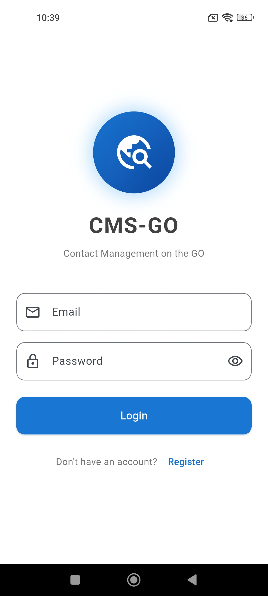
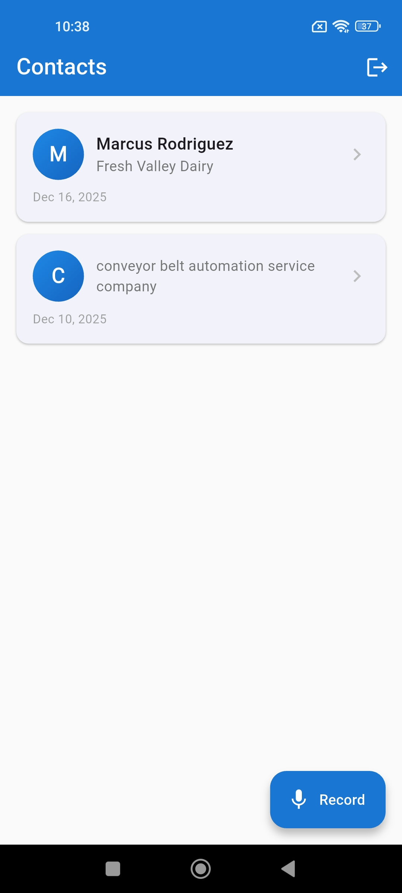
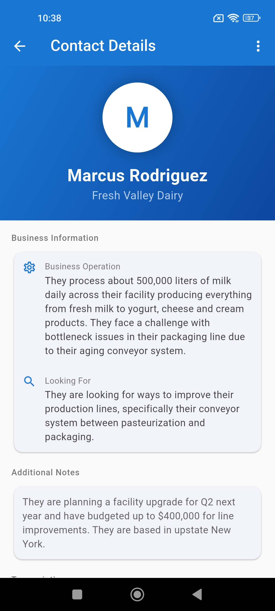
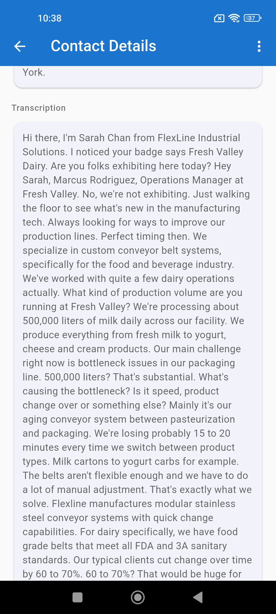
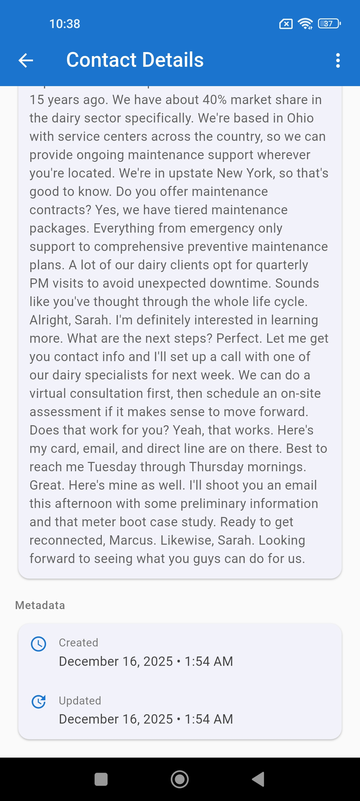
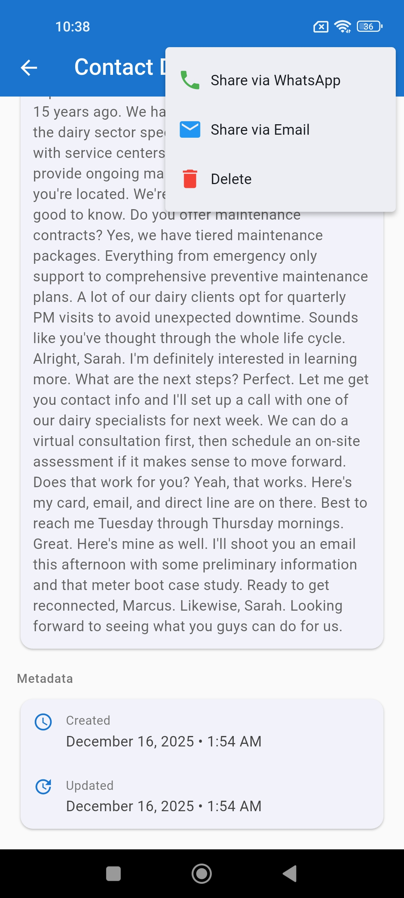
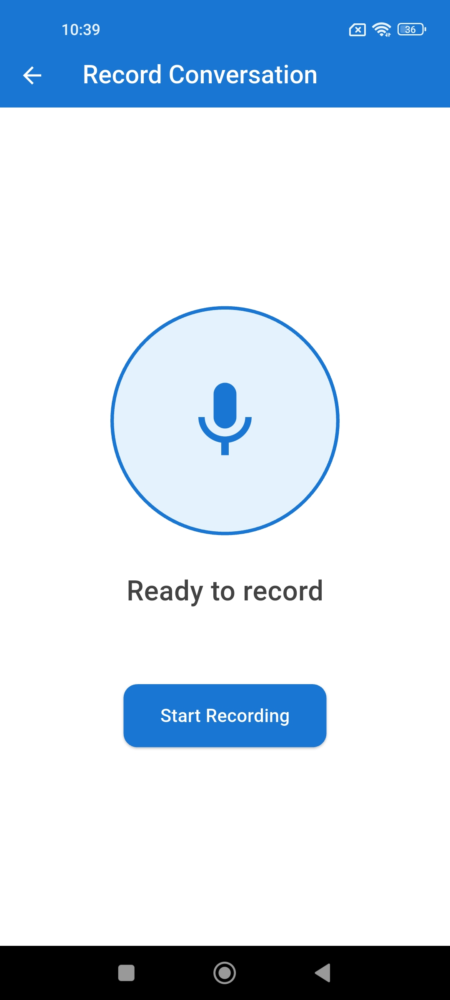

# Contact Management System (CMS)

An enterprise-grade mobile application for business development professionals to manage client contacts with AI-powered conversation recording and transcription.

## Features

- **Audio Recording**: Record face-to-face conversations with clients
- **AI Transcription**: Automatic speech-to-text with support for English and Mandarin
- **Smart Extraction**: AI-powered extraction of key business information
- **Contact Management**: Store and manage client contacts with detailed business information
- **Multi-Platform**: iOS and Android support via Flutter
- **Sharing**: Share contacts via Email and WhatsApp (not ready)
- **Secure Authentication**: User login and registration with JWT tokens
- **Offline Support**: Local database for offline access

## Future work
- **Sharing contacts**: Send contacts via WhatsApp or email.

## Demo app
<p align="center">
  
  
  
  
</p>
<p align="center">
  
  
  
</p>

## Tech Stack

### Frontend (Mobile App)
- **Flutter**: Cross-platform mobile development (iOS & Android)
- **Provider**: State management
- **SQLite**: Local database storage
- **Audio Recording**: Native microphone access
- **Material Design 3**: Modern, professional UI

### Backend
- **FastAPI**: High-performance Python web framework
- **PostgreSQL**: Robust relational database
- **OpenAI Whisper**: Speech-to-text transcription
- **OpenAI GPT-4**: Contact information extraction
- **Docker**: Containerized deployment
- **JWT**: Secure authentication

### Deployment Infrastructure (Suggestions)
- **AI backend**: Google Cloud Run
- **Database**: Supabase

## Project Structure

```
cms/
├── lib/                      # Flutter app source code
│   ├── models/              # Data models
│   ├── providers/           # State management
│   ├── screens/             # UI screens
│   ├── services/            # Business logic services
│   ├── utils/               # Utility functions
│   └── main.dart            # App entry point
├── backend/                 # Python backend
│   ├── app/
│   │   ├── main.py         # FastAPI application
│   │   ├── models.py       # Database models
│   │   ├── schemas.py      # Pydantic schemas
│   │   ├── auth.py         # Authentication logic
│   │   ├── ai_service.py   # OpenAI integration
│   │   ├── database.py     # Database connection
│   │   └── config.py       # Configuration
│   ├── Dockerfile          # Backend container config
│   ├── requirements.txt    # Python dependencies
│   └── .env.example        # Environment variables template
├── docker-compose.yml      # Docker orchestration
└── README.md              # This file
```

## Prerequisites

### For Flutter Development
- Flutter SDK (3.0.0 or higher)
- Dart SDK
- Android Studio / Xcode (for mobile development)
- Android SDK / iOS SDK

### For Backend Development
- Docker Desktop
- Docker Compose
- OpenAI API Key

## Installation & Setup

### 1. Backend Setup

#### Step 1: Configure Environment Variables

Copy the example environment file and configure it:

```bash
cd backend
cp .env.example .env
```

Edit `.env` and add your configuration:

```env
DATABASE_URL=postgresql://cms_user:cms_password@db:5432/cms_db
SECRET_KEY=your-secure-random-secret-key-here
OPENAI_API_KEY=your-openai-api-key-here
API_HOST=0.0.0.0
API_PORT=8000
```

**Important**:
- Replace `SECRET_KEY` with a strong random string (use `openssl rand -hex 32` to generate one)
- Add your OpenAI API key to `OPENAI_API_KEY`

#### Step 2: Start Backend Services

From the `cms` directory:

```bash
docker-compose up -d
```

This will start:
- PostgreSQL database on port 5432
- FastAPI backend on port 8000

Verify services are running:

```bash
docker-compose ps
```

Check backend health:

```bash
curl http://localhost:8000/health
```

View backend logs:

```bash
docker-compose logs -f backend
```

#### Step 3: Access API Documentation

Once the backend is running, you can access:
- API Documentation: http://localhost:8000/docs
- Alternative API Docs: http://localhost:8000/redoc

### 2. Flutter App Setup

#### Step 1: Install Dependencies

From the `cms` directory:

```bash
flutter pub get
```

#### Step 2: Configure Backend URL

Edit `lib/utils/constants.dart` and update the `baseUrl`:

```dart
// For Android Emulator
static const String baseUrl = 'http://10.0.2.2:8000/api';

// For iOS Simulator
// static const String baseUrl = 'http://localhost:8000/api';

// For Physical Device (replace with your computer's IP)
// static const String baseUrl = 'http://192.168.1.x:8000/api';
```

#### Step 3: Platform-Specific Configuration

**For Android:**

Permissions are already configured in `android/app/src/main/AndroidManifest.xml`

**For iOS:**

Update `ios/Runner/Info.plist` to add permissions:

```xml
<key>NSMicrophoneUsageDescription</key>
<string>This app needs microphone access to record conversations</string>
<key>NSPhotoLibraryUsageDescription</key>
<string>This app needs access to save recordings</string>
```

#### Step 4: Run the App

```bash
flutter run
```

Or for specific platform:

```bash
# For Android
flutter run -d android

# For iOS
flutter run -d ios
```

## Usage Guide

### 1. User Registration

1. Launch the app
2. Click "Register" on the login screen
3. Enter your name, email, and password
4. Click "Register" to create your account

### 2. Recording Conversations

1. From the home screen, tap the "Record" button
2. Tap "Start Recording" to begin recording
3. Have your conversation with the client
4. Tap "Stop" when finished
5. The app will automatically:
   - Transcribe the audio
   - Extract contact information
   - Create a new contact entry

### 3. Managing Contacts

- **View Contacts**: Browse all contacts on the home screen
- **Contact Details**: Tap any contact to view full details
- **Share via WhatsApp**: Use the menu to share contact via WhatsApp
- **Share via Email**: Use the menu to share contact via email
- **Delete Contact**: Use the menu to delete a contact

### 4. AI Processing

The app uses two AI services:

**Speech-to-Text (Whisper):**
- Converts audio recordings to text
- Supports English and Mandarin
- Provides timestamped transcriptions

**Information Extraction (GPT-4):**
- Analyzes transcriptions
- Extracts structured information:
  - Company name
  - Client name
  - Business model
  - Target market
  - Contact details
  - And more...

## Development

### Backend Development

To run backend in development mode:

```bash
cd backend
pip install -r requirements.txt
uvicorn app.main:app --reload
```

### Flutter Development

Hot reload is enabled by default. Make changes to the code and save to see updates immediately.

Run tests:

```bash
flutter test
```

Build for production:

```bash
# Android
flutter build apk --release

# iOS
flutter build ios --release
```

## Troubleshooting

### Backend Issues

**Container won't start:**
```bash
docker-compose down
docker-compose up --build
```

**Database connection errors:**
- Check if PostgreSQL container is healthy: `docker-compose ps`
- Check logs: `docker-compose logs db`

**OpenAI API errors:**
- Verify your API key in `.env`
- Check your OpenAI account has sufficient credits
- Review rate limits

### Flutter Issues

**Dependencies error:**
```bash
flutter clean
flutter pub get
```

**Build errors:**
```bash
flutter clean
flutter pub get
cd android && ./gradlew clean
cd .. && flutter run
```

**Recording not working:**
- Check microphone permissions are granted
- Verify AndroidManifest.xml / Info.plist have correct permissions

## Security Considerations

### Production Deployment

1. **Change default credentials** in `docker-compose.yml`
2. **Use strong SECRET_KEY** for JWT tokens
3. **Enable HTTPS** for API communication
4. **Restrict CORS** to specific origins
5. **Implement rate limiting** on API endpoints
6. **Secure OpenAI API key** using environment variables
7. **Regular security updates** for dependencies

### Data Privacy

- Audio recordings are processed but can be deleted after transcription
- User passwords are hashed using bcrypt
- JWT tokens expire after 7 days
- All data is encrypted in transit

## Support

For issues, questions, or contributions:
- Check the API documentation at http://localhost:8000/docs
- Review error logs in `docker-compose logs`
- Ensure all environment variables are properly configured

## License

This is a proprietary enterprise application. All rights reserved.

## Version

Current Version: 1.0.0

---

**Built for Business Development Professionals**
